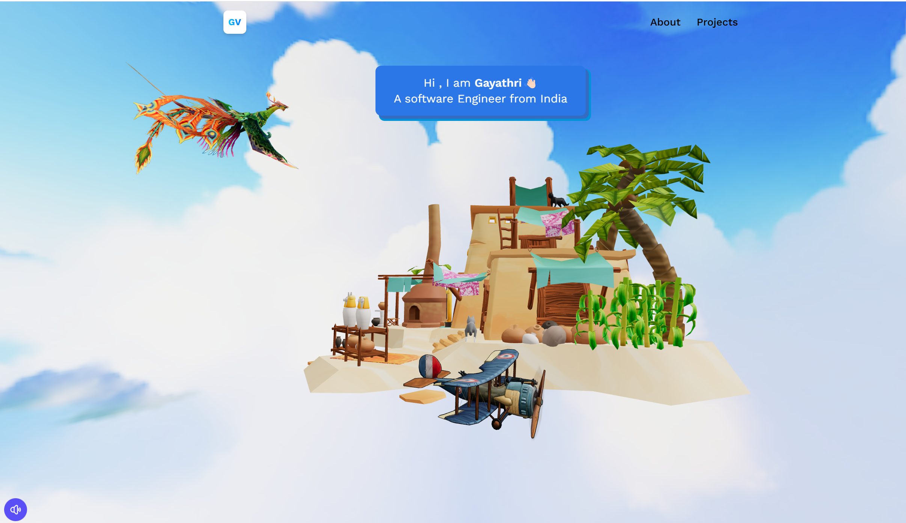

# Welcome to My 3D Portfolio

Welcome to my interactive 3D portfolio built with React Three Fiber. This project showcases various projects and skills in a visually captivating environment where users can explore different sections interactively. It showcases various projects and skills in a visually engaging manner. The portfolio includes dynamic elements such as rotating 3D models, an animated sky background, and an ambient soundtrack. Users can explore different sections by interacting with the 3D environment.




## Features

- **Dynamic 3D Models:** Engage with rotating 3D models that bring projects to life.
- **Immersive Environment:** An animated sky background enhances the visual experience.
- **Ambient Soundtrack:** Enjoy an ambient soundtrack that complements the interactive journey.

## Getting Started

Follow these steps to start exploring the portfolio on your local machine:

1. **Clone the Repository:** Clone this repository to your local machine using the command:
   ```
   git clone https://github.com/GayathriVijaya/3d_Portfolio.git
   ```
   
2. **Install Dependencies:** Navigate to the project directory and install dependencies:
   ```
   cd 3d_Portfolio
   npm install
   ```
   
3. **Run the Project:** Start the project locally:
   ```
   npm start
   ```
   Open your browser and go to `http://localhost:3000` to view the portfolio.

## Technologies Used

This project utilizes modern web technologies including:

- **React Three Fiber:** For building 3D interactive experiences.
- **JavaScript:** The primary programming language.
- **HTML/CSS:** Standard web technologies for structure and styling.


